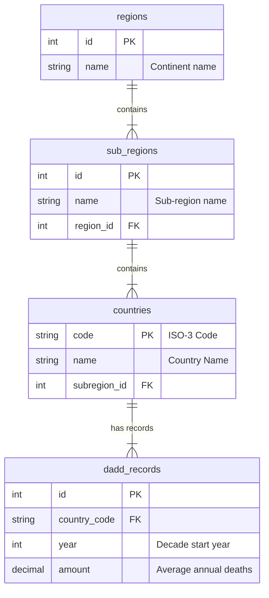

# Final Exam: DADD Web Application

## Project Overview

This web application analyzes the **Decadal Average Annual Number of Deaths from Disasters (DADD)**, providing comprehensive tools for querying, managing, and comparing disaster mortality data across countries, regions, and decades.

**Data Sources:**
- [Our World in Data](https://ourworldindata.org/)
- [Kaggle - Country Mapping Dataset](https://www.kaggle.com/datasets/andradaolteanu/country-mapping-iso-continent-region)

**Coverage:** 248 countries, 5 regions, 17 sub-regions, 2,652 DADD records

## Database Design (ER Model)

This project uses a relational database design conforming to the **3rd Normal Form (3NF)**.
It consists of **4 entities** to handle hierarchical region data and disaster statistics.



### Normalization Justification

**1NF (First Normal Form):**
- All tables have atomic values (no repeating groups)
- Each column contains single values
- Primary keys are defined for all tables

**2NF (Second Normal Form):**
- No partial dependencies exist
- All non-key attributes fully depend on the entire primary key
- Example: `sub_regions.name` depends on `sub_regions.id`, not just part of a composite key

**3NF (Third Normal Form):**
- No transitive dependencies
- Region hierarchy is properly normalized: countries → sub_regions → regions
- DADD records reference countries via foreign key, not storing redundant country information

## Features

### Query Features
1. **Country History**: View historical DADD data for a specific country over decades
2. **Sub-Region Ranking**: Rank countries by DADD within a sub-region for a specific decade
3. **Regional Maximum**: Display maximum DADD by sub-regions within a region
4. **Search Countries**: Keyword search on country names showing latest decade DADD

### Data Management Features
5. **Add New Record**: Insert DADD record for the next decade
6. **Update Record**: Modify existing DADD record for a country and decade
7. **Delete Records**: Remove DADD records within a decade range

### Custom Feature
8. **Regional Comparison**: Compare average DADD across all regions for a selected decade

## Technologies Used

- **Backend:** Node.js 18, Express.js 4.18.2
- **Frontend:** HTML5, CSS3, Bootstrap 5.3.0, HTMX 1.9.10
- **Database:** MySQL 8.0
- **Deployment:** Docker & Docker Compose

## Quick Start

### Prerequisites
- Docker Desktop installed and running
- Git installed

### Installation & Running

```bash
# Clone the repository
git clone https://github.com/Dopee0508/M11405506-Final_Exam.git
cd M11405506-Final_Exam

# Start the application
docker compose up

# Access the application at http://localhost:3000
```

The application will automatically:
1. Initialize MySQL database
2. Run ETL process to load data from CSV files
3. Start the Express web server

### Stopping the Application

```bash
docker compose down
```

## Project Structure

```
M11405506-Final_Exam/
├── app/
│   ├── views/
│   │   └── index.html          # Main web interface
│   ├── app.js                   # Express server & API endpoints
│   ├── package.json             # Node.js dependencies
│   └── Dockerfile               # Web service container config
├── database/
│   ├── ETL.sql                  # Database schema & ETL script
│   ├── data1.csv                # DADD facts data
│   └── data2.csv                # Countries/regions data
├── compose.yaml                 # Docker Compose configuration
└── README.md                    # This file
```

## Development Notes

- All database operations use normalized tables (regions, sub_regions, countries, dadd_records)
- HTMX is used for dynamic UI updates without page refreshes
- Dropdown menus are populated via JavaScript fetch API for reliability
- All 8 features are fully implemented with proper error handling

## Author

**Student ID:** M11405506  
**Repository:** https://github.com/Dopee0508/M11405506-Final_Exam